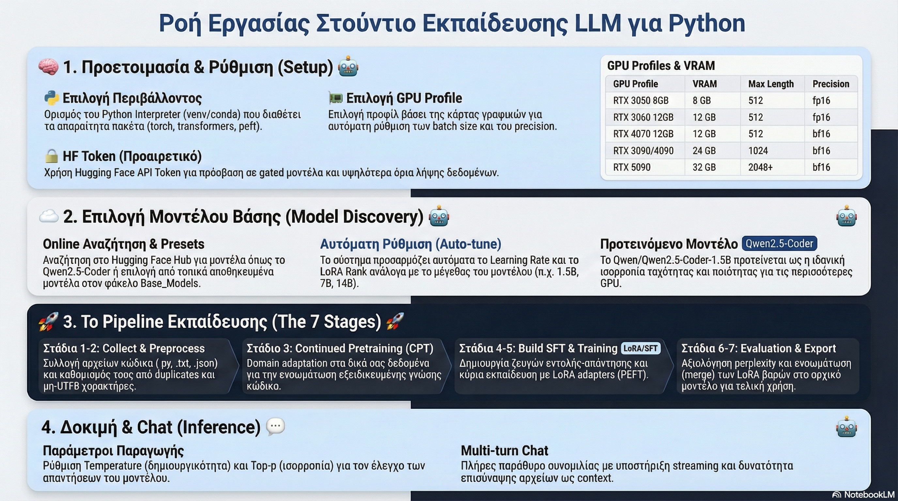

# LLM Training Studio

<p align="center">
  <strong>Ένα ολοκληρωμένο single-file Studio για εκπαίδευση, αξιολόγηση, export και δοκιμή LLMs για Python code.</strong>
</p>

<p align="center">
  
  
  
  
  
  
</p>

---

## Τι είναι

Το **LLM Training Studio** είναι μία desktop εφαρμογή σε **PySide6** που συγκεντρώνει σε **ένα μόνο αρχείο Python** όλη τη βασική ροή για:

- επιλογή και λήψη base model από το Hugging Face
- δημιουργία runtime/training configuration
- συλλογή και προεπεξεργασία δεδομένων
- **Continued Pretraining (CPT)**
- **Supervised Fine-Tuning (SFT)** με **LoRA / PEFT**
- αξιολόγηση του μοντέλου
- export του τελικού μοντέλου
- realtime inference και multi-turn chat
- upload / διαχείριση model repos στο **Hugging Face Hub**

Η εφαρμογή είναι σχεδιασμένη ειδικά για workflows που σχετίζονται με **Python code generation**, **instruction tuning**, **domain adaptation** και **τοπική GPU εκπαίδευση** με ασφαλή προφίλ για διαφορετικές RTX κάρτες.

---

## Γιατί ξεχωρίζει

- **Single-file αρχιτεκτονική**: GUI, pipeline, training logic, inference και Hub integration σε ένα `.py`
- **End-to-end workflow**: από τη συλλογή δεδομένων μέχρι το τελικό export
- **LoRA fine-tuning** για χαμηλότερες απαιτήσεις VRAM
- **CPT + SFT** στο ίδιο περιβάλλον εργασίας
- **Realtime inference** με streaming απάντηση
- **Multi-turn chat** για χειροκίνητη αξιολόγηση του μοντέλου
- **Hugging Face Hub Manager** για upload, model cards και δοκιμές
- **Auto-tuned RTX profiles** με προσαρμογή παραμέτρων ανά VRAM και μέγεθος μοντέλου
- **Light / Dark theme**
- **Logs και error tracing** για πιο ασφαλές debugging

---

## Κύριες δυνατότητες

### 1) Εκπαίδευση από GUI
Η καρτέλα εκπαίδευσης οργανώνει όλη τη ροή:

- επιλογή Python interpreter
- επιλογή προφίλ GPU / VRAM
- online αναζήτηση μοντέλων
- λήψη base model στο `Base_Models/`
- δημιουργία και χρήση ενεργού config
- εκτέλεση pipeline ανά στάδιο ή αυτόματα

### 2) Πλήρες pipeline
Η εφαρμογή υποστηρίζει τα παρακάτω στάδια:

1. **Collect** — συλλογή πηγών από αρχεία, φακέλους και web
2. **Preprocess** — καθαρισμός, φιλτράρισμα και προετοιμασία corpus
3. **CPT** — domain adaptation με next-token prediction
4. **Build SFT** — δημιουργία instruction/response dataset
5. **SFT** — fine-tuning με LoRA adapters
6. **Evaluate** — αξιολόγηση με loss / perplexity / generation samples
7. **Export** — εξαγωγή τελικού μοντέλου έτοιμου για deployment ή upload

### 3) Realtime inference και chat
Μετά την εκπαίδευση μπορείς να:

- δοκιμάσεις prompts σε realtime
- δεις streamed απάντηση
- κάνεις multi-turn συνομιλία
- αποθηκεύσεις ή αντιγράψεις τα outputs
- σταματήσεις ενεργή παραγωγή χωρίς να κλείσεις την εφαρμογή

### 4) Hugging Face Hub integration
Η εφαρμογή περιλαμβάνει ξεχωριστό **Hub Manager** για:

- upload μοντέλων
- διαχείριση repos
- δημιουργία / επεξεργασία `README.md` model card
- quick test μοντέλου από το Hub
- άνοιγμα repo απευθείας στο browser

---

## Αρχιτεκτονική εφαρμογής

Η φιλοσοφία του project είναι:

> **Ένα Python αρχείο, ένα ολοκληρωμένο training studio.**

Αυτό σημαίνει ότι στο ίδιο αρχείο βρίσκονται:

- το GUI
- η εκτέλεση των εσωτερικών pipeline stages
- ο μηχανισμός inference
- helpers για datasets / configs / logging
- η ολοκλήρωση με Hugging Face Hub

Αυτή η προσέγγιση κάνει το project:

- εύκολο στη μεταφορά
- πιο απλό στη διανομή
- ιδανικό για standalone εργαλεία ή μελλοντικό packaging σε `.exe`

---

## Υποστηριζόμενα δεδομένα

Το Collect στάδιο μπορεί να χρησιμοποιήσει τοπικές και web πηγές.

### Υποστηριζόμενοι τύποι αρχείων
- `.py`, `.pyi`
- `.md`, `.txt`, `.rst`
- `.json`, `.jsonl`
- `.yaml`, `.yml`
- `.toml`, `.ini`, `.cfg`
- `.csv`, `.tsv`
- `.xlsx`, `.xlsm`
- `.ipynb`
- `.pdf`, `.doc`, `.docx`
- `.html`, `.htm`, `.xml`

### Web συλλογή
Η εφαρμογή μπορεί να χρησιμοποιήσει:

- αγγλικές πηγές
- ελληνικές πηγές
- προσαρμοσμένα URLs
- φίλτρα γλώσσας
- validation πληρότητας πηγών πριν μπουν στο corpus

### Μορφές training data
Υποστηρίζονται:

- αρχεία Python code
- documentation / notes / technical text
- instruction datasets
- prompt / output datasets
- structured JSONL records

---

## Τεχνολογίες

Το project βασίζεται κυρίως στα παρακάτω:

- **PySide6**
- **PyTorch**
- **Transformers**
- **PEFT / LoRA**
- **Hugging Face Hub**
- **datasets**
- **pandas / openpyxl**
- **python-docx**

Προαιρετικά ή συνιστώμενα σε ορισμένα workflows:

- `trl`
- `accelerate`

---

## Απαιτήσεις

- **Python 3.10+**
- **NVIDIA GPU** συνιστώμενη για training / inference
- **CUDA-compatible PyTorch** για επιτάχυνση
- Λογαριασμός **Hugging Face** για model downloads / uploads
- Προαιρετικά: **HF token** για private repos ή upload

---

## Εγκατάσταση

### 1. Clone το repository
```bash
git clone https://github.com/<your-username>/<your-repo>.git
cd <your-repo>
```

### 2. Δημιούργησε virtual environment
```bash
python -m venv .venv
```

#### Windows
```bash
.venv\Scripts\activate
```

#### Linux / macOS
```bash
source .venv/bin/activate
```

### 3. Εγκατάσταση βασικών πακέτων
```bash
pip install -U PySide6 torch transformers accelerate peft huggingface_hub datasets pandas openpyxl python-docx
```

### 4. Προαιρετικά πακέτα
```bash
pip install -U trl
```

> Για CUDA-enabled PyTorch, προτίμησε την εγκατάσταση από τις επίσημες οδηγίες της PyTorch ανάλογα με την GPU και την έκδοση CUDA σου.

---

## Εκτέλεση

```bash
python LLM_Training_Studio.py
```

Η εφαρμογή ανοίγει ως desktop GUI και από εκεί χειρίζεσαι όλο το workflow.

---

## Γρήγορη εκκίνηση

### Βήμα 1 — Επίλεξε Python interpreter
Χρησιμοποίησε το interpreter του virtual environment που έχει όλα τα πακέτα training.

### Βήμα 2 — Επίλεξε προφίλ GPU
Διάλεξε το κατάλληλο προφίλ για την κάρτα σου, π.χ.:

- RTX 3060 12GB
- RTX 4070 12GB
- RTX 4090 24GB
- κ.ά.

Τα προφίλ προσαρμόζουν αυτόματα παραμέτρους όπως:

- `max_length`
- `micro_batch_size`
- `gradient_accumulation_steps`
- `learning_rate`
- `LoRA r / alpha`

### Βήμα 3 — Διάλεξε base model
Αναζήτησε online ή φόρτωσε preset model.  
Προτεινόμενο σημείο εκκίνησης για code workflows:

```text
Qwen/Qwen2.5-Coder-1.5B
```

### Βήμα 4 — Κατέβασε το μοντέλο
Το model snapshot αποθηκεύεται τοπικά στον φάκελο:

```text
Base_Models/
```

### Βήμα 5 — Δημιούργησε config
Η εφαρμογή δημιουργεί το ενεργό JSON config που χρησιμοποιείται από τα στάδια του pipeline.

### Βήμα 6 — Πρόσθεσε δεδομένα
Μπορείς να προσθέσεις:

- Python αρχεία
- documentation
- JSONL instruction datasets
- φακέλους πηγών
- web URLs

### Βήμα 7 — Τρέξε το pipeline
Επιλογές:

- **Auto**
- εκτέλεση κάθε σταδίου ξεχωριστά

### Βήμα 8 — Δοκίμασε το μοντέλο
Χρησιμοποίησε:

- **Inference**
- **Chat**
- **Hub Quick Test**

### Βήμα 9 — Κάνε export / upload
Το τελικό μοντέλο μπορεί να εξαχθεί και να ανέβει στο Hugging Face Hub.

---

## Παράδειγμα ροής χρήσης

1. Επιλέγω interpreter
2. Επιλέγω GPU profile
3. Αναζητώ base model
4. Κατεβάζω το model locally
5. Δημιουργώ config
6. Προσθέτω αρχεία Python και JSONL datasets
7. Τρέχω Collect → Preprocess → CPT → Build SFT → SFT
8. Κάνω Evaluate
9. Δοκιμάζω το μοντέλο στο chat
10. Κάνω Export
11. Ανεβάζω το αποτέλεσμα στο Hugging Face

---

## Δομή φακέλων

```text
LLM_Training_Studio/
├── LLM_Training_Studio.py
├── Base_Models/
├── artifacts/
│   ├── 01_collect/
│   ├── 02_preprocess/
│   ├── 03_cpt/
│   ├── 04_build_sft/
│   ├── 05_sft/
│   └── final_model/
├── runtime_configs/
├── logs/
├── config_default.json
├── config_rtx3060_12gb_safe.json
└── model_presets.json
```

---

## Παραγόμενα artifacts

### Collect
```text
artifacts/01_collect/raw_corpus.jsonl
```

### Preprocess
```text
artifacts/02_preprocess/preprocessed_corpus.jsonl
```

### Build SFT
```text
artifacts/04_build_sft/sft_dataset.jsonl
```

### SFT output
```text
artifacts/05_sft/
```

### Final export
```text
artifacts/final_model/
```

### Logs
```text
logs/
logs/errors.log
```

---

## Αξιολόγηση μοντέλου

Το evaluation στάδιο μπορεί να χρησιμοποιήσει διαθέσιμα eval records και να υπολογίσει:

- average loss
- weighted loss
- perplexity
- sample generations
- generation scoring / rubric metrics

Έτσι μπορείς να έχεις τόσο **ποσοτική** όσο και **ποιοτική** εικόνα του αποτελέσματος.

---

## Hugging Face Hub Manager

Ο ενσωματωμένος Hub Manager προσφέρει ένα πλήρες panel για:

- επιλογή namespace
- φόρτωση repos
- upload νέου μοντέλου
- συγγραφή και αποθήκευση `README.md`
- quick chat / test μοντέλου
- commit messages για uploads

Αν δουλεύεις συχνά με HF repos, αυτή η δυνατότητα μειώνει σημαντικά την ανάγκη για ξεχωριστά terminal scripts.

---

## Συντομεύσεις πληκτρολογίου

- `Ctrl + R` → Τρέξε όλο το pipeline
- `Ctrl + Shift + R` → Auto: αναζήτηση → λήψη → config → pipeline
- `Ctrl + Enter` → Εκτέλεση chat / inference / quick test
- `Ctrl + L` → Καθαρισμός logs / chat
- `Ctrl + S` → Αποθήκευση ρυθμίσεων
- `F5` → Ανανέωση λίστας μοντέλων
- `Ctrl + K` → Τερματισμός τρέχουσας διεργασίας

---

## Για ποιους είναι

Το project είναι χρήσιμο για:

- developers που θέλουν να fine-tune code models
- ερευνητές που θέλουν desktop workflow αντί για scattered scripts
- χρήστες που χρειάζονται GUI για Hugging Face training workflows
- εκπαιδευτικούς / εργαστήρια που θέλουν οργανωμένη ροή για local LLM experimentation
- power users που θέλουν export-ready local models

---

## Σημεία προσοχής

- Για μεγάλες παραμέτρους training απαιτείται επαρκής VRAM
- Για gated models πρέπει πρώτα να έχεις αποδεχτεί τους όρους στο Hugging Face
- Για upload σε private repos χρειάζεται valid **HF token**
- Για πιο σταθερή εμπειρία ξεκίνα με **ασφαλές GPU profile**
- Για αρχεία Excel / DOCX / PDF χρειάζονται τα κατάλληλα dependencies εγκατεστημένα

---

## Προτεινόμενα επόμενα βήματα για το repository

Για να δείχνει ακόμα πιο επαγγελματικό στο GitHub, πρόσθεσε επιπλέον:

- screenshots από το GUI
- ένα μικρό demo GIF
- `requirements.txt`
- `LICENSE`
- ενότητα “Known Issues”
- ενότητα “Changelog”
- 2-3 παραδείγματα χρήσης με πραγματικά datasets

---

## Screenshot placeholders

Μπορείς να προσθέσεις αργότερα εικόνες όπως:

```md


```

---

## License

Πρόσθεσε εδώ την άδεια του project σου, π.χ.:

```text
MIT License
```

ή

```text
Apache-2.0
```

---

## Author

**Ευάγγελος Πεφάνης**

Αν θέλεις, μπορείς να βάλεις εδώ και links προς:

- GitHub profile
- Hugging Face profile
- portfolio / website
- παρουσιάσεις ή demos

---

## Σύντομη περιγραφή για GitHub repository

Αν θέλεις ένα έτοιμο one-line description για το repository:

> Desktop PySide6 studio for end-to-end LLM training workflows: data collection, preprocessing, CPT, SFT with LoRA, evaluation, export, realtime inference, chat, and Hugging Face Hub integration.

---

## Tags / Topics για GitHub

Προτεινόμενα GitHub topics:

```text
llm
fine-tuning
lora
peft
transformers
huggingface
pyside6
python
code-generation
instruction-tuning
desktop-app
machine-learning
deep-learning
```

